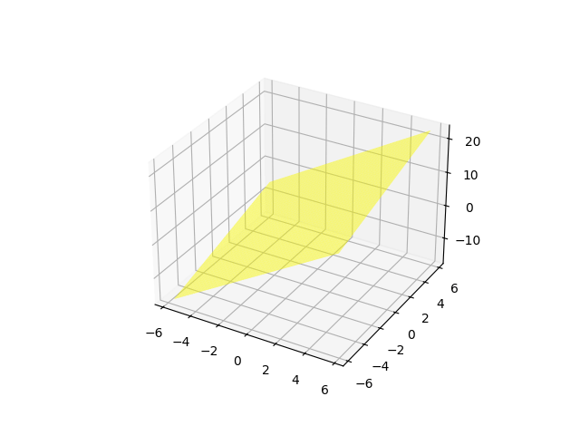

# Proyecciones ortogonales y rotaciones

## Entrega 3

### Observaciones y formato

- [x] Implementar un visualizador para los procesos
- [ ] Agregar figuras y diagramas al informe (ecuaciones NO IMG)
- [ ] Codigo al 100%
- [ ] validar resultados para cada ejecucion (3 ejemplos)

### TODO S10

- [x] Desespagetizar
- [x] Vizualizar rotacion / del punto [v1 | v2]*
- [ ] Animar la rotacion del punto por el metodo geometrico

- [ ] Mejorar visualizacion (grado a grado?) (crecer el vector?)
- [ ] Try mantener zoom aplicado entre visualizaciones
- [ ] implementar funcionalidades didacticas
- [ ] Escoger estilo [Estilos MPL] (<https://python-charts.com/es/matplotlib/estilos/#google_vignette>)
- [ ] Actualizar link ejecutable y README.MD

---

## Descripcion del proyecto

Las proyecciones ortogonales y las rotaciones, son piedras angulares en disciplinas como arquitectura, ingeniería y diseño. Sin embargo, su abstracción y complejidad pueden ser intimidantes. ¿Cómo hacer que estas ideas cobren vida y sean comprensibles para todos? En este proyecto, abordaremos este desafío mediante la creación de simulaciones computarizadas. Desde la formulación de ecuaciones hasta la manipulación de objetos en un espacio 3D, nuestro objetivo es hacer que las proyecciones y las rotaciones sean accesibles para todos.

## Ejecutable

Para usar el programa, descarga el ejecutable desde el siguiente enlace: [Descargar ejecutable](https://github.com/202210494/algebra-lineal-grupo-04/releases/download/v1/MA331_2024-01_Proyecto_Grupo_4.exe)
